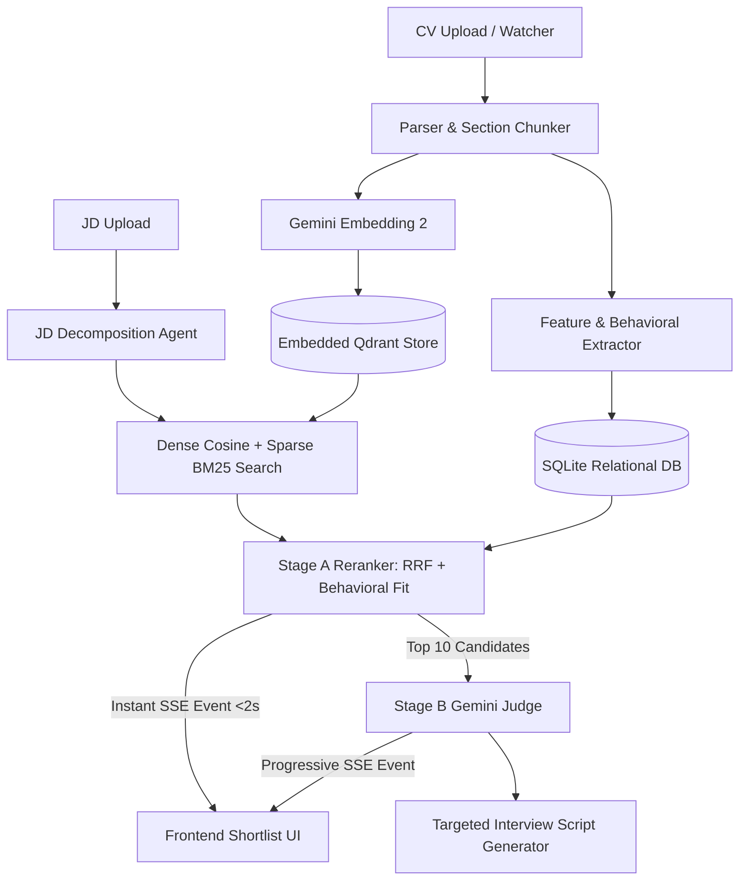

# 🤖 AI Recruiter — Ranked Candidate Shortlisting PoC

An end-to-end autonomous candidate discovery and evaluation system built by pair programming with Google DeepMind Antigravity. Powered by **Gemini 3.1 Pro** and **Gemini Embedding 2**.

---

## ✨ Features

- **Section-Aware Resume Parsing**: Splits PDF/Text CVs into semantic chunks (`experience`, `education`, `skills`, `certifications`).
- **Hybrid Search Architecture**: Stores dense cosine vectors in an embedded **Qdrant** database (`./data/qdrant_storage`) and relational metadata in **SQLite** (`./data/recruiter.db`).
- **Reciprocal Rank Fusion (RRF)**: Combines dense vector retrieval with BM25 sparse keyword scoring.
- **Fairness by Design**: Strictly blocks protected characteristic proxies (name, age, gender, photo, graduation year) during Stage A retrieval.
- **Progressive SSE Streaming**: Delivers sub-2-second Stage A shortlisting, followed by progressive live enrichment from a Stage B Gemini Judge.
- **Risk-Grounded Interview Guide**: Automatically synthesizes targeted interview questions probing a candidate's weakest resume evidence.
- **Premium Glassmorphic UI**: Built with vanilla CSS globals/modules in Next.js (zero TailwindCSS dependency).

---

## 🏗️ Architecture Flow



---

## 🚀 Getting Started (Local Installation)

### Prerequisites

- **macOS** or **Linux**
- **Python 3.11+**
- **Node.js 18+** & `npm`
- **Google Gemini API Key** (Get one at [Google AI Studio](https://aistudio.google.com/))

---

### Step 1: Clone the Repository

```bash
git clone https://github.com/Anupamgt/ai-recruiter-poc.git
cd ai-recruiter-poc
```

---

### Step 2: Configure Environment Variables

Create `.env` files for both backend and frontend.

#### Backend Configuration (`backend/.env`)
```bash
cp .env.example backend/.env
```
Edit `backend/.env` and paste your Gemini API Key:
```env
GOOGLE_API_KEY="AIzaSyYourActualGeminiApiKeyHere"
LLM_MODEL_ID="gemini-3.1-pro-preview"
EMBEDDING_MODEL_ID="text-embedding-004"
FRONTEND_URL="http://localhost:3005"
```

#### Root Configuration (`.env`)
```bash
cp .env.example .env
```
Paste the same API key inside `.env`.

---

### Step 3: Setup & Run Backend Server

Open a terminal window:

```bash
cd backend

# Create & activate virtual environment (optional but recommended)
python3 -m venv venv
source venv/bin/activate

# Install dependencies
pip install -r requirements.txt

# Generate synthetic sample resumes for testing
python3 scripts/generate_synthetic_data.py

# Start the FastAPI backend server
python3 -m app.main
```

The backend server will start on **`http://localhost:8000`**.
- Interactive API Swagger Docs: `http://localhost:8000/docs`
- Background file watcher monitors `backend/data/sample_resumes/` for dropped CVs.

---

### Step 4: Setup & Run Frontend Web App

Open a **new terminal window**:

```bash
cd frontend

# Install Node dependencies
npm install

# Start the Next.js development server on port 3005
npm run dev -- -p 3005
```

Open your browser and navigate to **[http://localhost:3005](http://localhost:3005)**.

*(Note: Port 3005 is used by default to avoid conflicts with existing local projects on port 3000).*

---

## 🧪 Testing & Verification

Run automated unit tests to verify Stage A fairness constraints:

```bash
cd backend
python3 -m pytest tests/test_fairness.py
```

---

## 📂 Repository Structure

```text
ai-recruiter-poc/
├── backend/
│   ├── app/
│   │   ├── api/routes.py          # FastAPI endpoints (CV/JD upload, SSE streaming)
│   │   ├── db/                    # SQLite SQLAlchemy models & session
│   │   ├── embeddings/            # Gemini client wrapper
│   │   ├── ingestion/             # Dedup hashing, PDF parser, background file watcher
│   │   ├── parsing/               # Semantic resume chunker & feature extractor
│   │   ├── ranking/               # JD decomposer, Stage A Reranker, Stage B LLM Judge
│   │   ├── retrieval/             # Embedded Qdrant vector store & RRF hybrid fusion
│   │   └── signals/               # Non-keyword behavioral signal extractor
│   ├── scripts/                   # Synthetic resume generator
│   └── tests/                     # Fairness & blocked feature test suite
└── frontend/
    └── src/app/
        ├── components/            # CandidateCard, StageIndicator, InterviewGuide, LatencyCounter
        ├── shortlist/[jdId]/      # Live SSE Shortlist Dashboard
        └── upload-jd/             # Job Description Kickoff Form
```

---

## 🛡️ License

MIT License. Created for demonstration and evaluation purposes.
